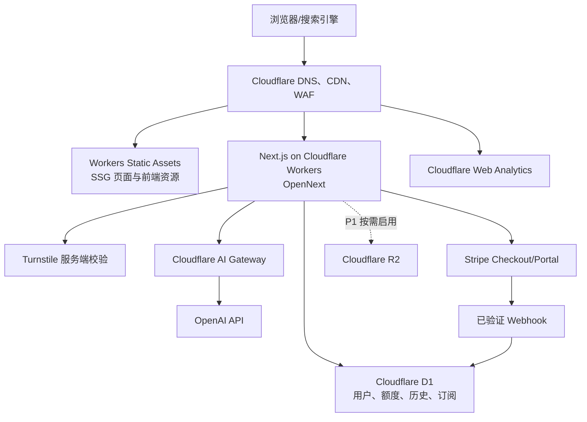

# PinTextAI 产品需求文档（PRD）

> **文档版本**：v1.5（Pinterest-inspired 最终架构版）  
> **创建日期**：2026-07-20  
> **整理日期**：2026-07-20  
> **原始作者**：哥飞 SEO Agent（基于哥飞社群方法论）  
> **状态**：待评审  
> **产品形态**：面向 Pinterest 创作者的 AI 文案 SaaS  
> **成本原则**：MVP 阶段除域名、AI Token 和成交后的支付手续费外，基础设施月固定成本目标为 $0

---

## 0. 文档说明

### 0.1 本版整理内容

本版在不改变产品核心方向的前提下完成以下调整：

1. 合并原稿中重复、截断和相互冲突的章节，统一产品范围、交互、数据模型和排期。
2. 删除 Vercel、Vercel Postgres、Vercel Analytics 等依赖，改为 Cloudflare 原生方案。
3. 保留 Next.js App Router，通过 Cloudflare OpenNext 适配器部署到 Cloudflare Workers。
4. 将 PostgreSQL/Supabase + Prisma 调整为 Cloudflare D1 + Drizzle ORM，降低固定成本和边缘运行时开销。
5. 将“无限 AI 生成”改为高额度 Credit，避免订阅收入被异常 Token 消耗击穿。
6. 为免费试用增加 Turnstile、限流、原子扣额和成本熔断要求。
7. 将自动公开 UGC 改为用户主动授权、人工/规则审核后发布，避免隐私和低质量规模化内容风险。
8. 将无法证实或容易过时的数据改为“待验证假设”，上线前必须重新核验。
9. 按《线路 A / 线路 B —— UI/UX 参考全解析》纳入线路 B 的首屏工具、结果编辑、软升级引导和统一视觉规范。
10. 品牌统一为 PinTextAI，正式域名确定为 `PinTextAI.com`，并明确生产环境主域、跳转和 canonical 规则。
11. 将逐次填写 Topic 的单一输入方式升级为“文字或 URL 智能输入 → 来源预览确认 → 生成”，并为高频用户规划 Content Library、多 URL 与 CSV 批量入口。
12. 最终 UI 架构确定为：公开工具页采用低摩擦单任务结构，登录工作台采用三栏生产结构，并吸收创作者工作室的亲和细节；颜色与内容节奏借鉴 Pinterest，但使用 PinTextAI 原创标志、组件和视觉语言。

### 0.2 关键假设

- 首发市场为英语用户，目标人群主要是 Etsy 卖家、博客作者、小型电商运营者和 Pinterest 营销人员。
- 关键词难度数据来自原始调研，查询日期为 2026-07-20；搜索量、SERP 和竞品状态需在开发前再次验证。
- MVP 不依赖 Pinterest API，不承诺自动发布、账号抓取或实时 Pinterest Analytics。
- 用户输入可能包含产品信息或商业素材，默认不公开、不用于模型训练，公开案例必须单独授权。
- P0 只按用户主动提交的单个公开商品页、文章页或落地页 URL 提取生成上下文；不抓取 Pinterest 账号、Board、竞品 Pin 或整站内容，提取失败时必须允许用户回退到手动描述。
- 正式域名为 `PinTextAI.com`；生产环境统一使用 `https://pintextai.com` 作为主站与 canonical 基准。`www.pintextai.com` 必须 301 重定向到主域，`workers.dev` 仅用于开发和预览，且不得被搜索引擎索引。

---

## 1. 产品概述

### 1.1 一句话描述

PinTextAI 是一个面向 Pinterest 创作者的 AI 文案工作台，帮助 Etsy 卖家、博客作者和电商运营者快速生成、优化和批量导出 Pin 标题、描述、Caption 与 Hashtag。

### 1.2 用户问题

目标用户通常面临以下问题：

- 不熟悉 Pinterest 搜索和推荐机制，不知道关键词应该放在哪里。
- 同一商品需要持续制作多个 Pin，人工改写标题和描述耗时。
- 通用 AI 工具缺少 Pinterest 场景约束，结果重复、过长或缺少行动引导。
- 团队在表格、AI 对话和发布工具之间反复复制，缺少可复用历史记录。
- Etsy 卖家和博客作者已经在商品页或文章中维护了完整信息，却需要在每次生成时重新描述同一内容，重复输入效率低且容易遗漏卖点。

### 1.3 产品价值主张

- **更快**：用户可直接粘贴商品/文章 URL 或输入主题；来源确认后到 10 个候选标题的目标完成时间 ≤ 8 秒。
- **更贴近平台场景**：内置长度、关键词位置、语气、CTA 和去重规则。
- **来源驱动**：复用用户已有商品页、文章和落地页信息，减少重复填写；高频用户可在 P1 保存为 Content Library。
- **可复用**：保存生成历史和内容来源，支持一键再次生成、复制和 CSV 导出。
- **先试后注册**：首次体验不设置注册墙，用户看到价值后再注册。
- **成本可控**：以额度、模型路由和熔断控制 AI 变量成本。

### 1.4 为什么选择 SaaS

| 维度 | 下载/流量工具 | PinTextAI 创作 SaaS |
|---|---|---|
| 核心动机 | 完成一次性任务 | 持续提升内容生产效率 |
| 使用频率 | 低 | 中高，随商品和内容更新重复发生 |
| 变现方式 | 广告 | 订阅与高额度套餐 |
| 产品壁垒 | 页面和代码 | 场景 Prompt、质量校验、历史数据与工作流 |
| 增长方式 | 依赖单一搜索词 | 工具页、内容页、案例页和口碑共同增长 |

### 1.5 成功目标

| 阶段 | 产品目标 | 商业/增长目标 |
|---|---|---|
| 第 1-2 周 | Title Generator 上线，可匿名试用 | GSC 验证并提交 Sitemap |
| 第 3-4 周 | 登录、免费额度、历史记录、另外 3 个生成器 | 出现稳定自然展示和首批注册 |
| 第 5-8 周 | Stripe 订阅、批量工作台、成本监控 | 获得首笔真实订阅收入 |
| 第 3 个月 | 优化留存、Prompt 和工具页内容 | 验证免费到付费转化率 |
| 第 6 个月 | 评估 Analyzer、API 与团队版 | 目标 150-200 个付费用户；目标值不是承诺 |

### 1.6 核心指标

#### 北极星指标

**每周完成至少 2 次有效生成并复制/导出结果的活跃用户数（WAGU）。**

#### 漏斗指标

| 环节 | 指标 | MVP 目标 |
|---|---|---|
| 获客 | 工具页自然点击、非品牌词占比 | 建立基线后逐周提升 |
| 激活 | 首次访问后成功生成率 | ≥ 60% |
| 价值感知 | 生成后复制或保存率 | ≥ 35% |
| 注册 | 匿名试用后注册率 | ≥ 8% |
| 留存 | 注册用户 7 日内再次生成率 | ≥ 20% |
| 付费 | 激活用户到付费转化率 | 首阶段 1%-3%，验证后再调整 |
| 质量 | 用户主动“有用”反馈率 | ≥ 70% |
| 成本 | AI 成本/订阅收入 | 稳态目标 ≤ 20% |
| 输入效率 | 首次提交前手动填写字段数 | 中位数 ≤ 2 |
| 来源体验 | URL 成功形成可确认预览的比例 | 支持范围内 ≥ 90% |
| 来源复用 | 登录用户从历史/内容库再次生成占比 | 建立基线后逐周提升 |

---

## 2. 用户与使用场景

### 2.1 核心用户

| 用户 | 典型任务 | 主要痛点 | 最有价值的功能 |
|---|---|---|---|
| Etsy 卖家 | 为多个商品持续制作 Pin | 商品多、重复写文案耗时 | Listing URL、商品来源库、CSV 批量生成 |
| 博客作者 | 为文章制作多个 Pin 版本 | 重复概括文章、标题角度单一 | Article URL、多 URL、角度模板 |
| 小型电商运营 | 为活动和商品做内容分发 | 商品资料分散、风格不统一 | Product/Collection URL、Brand Profile |
| Pinterest 营销人员 | 优化多个客户账号内容 | 需要快速导入、产出和审阅 | 内容来源库、批量工作台、客户品牌预设 |

### 2.2 核心用户故事

- 作为首次访问者，我希望不注册就能生成一次结果，以判断工具是否值得使用。
- 作为免费用户，我希望知道今天还剩多少额度，避免提交后才看到失败。
- 作为 Etsy 卖家，我希望为同一商品生成多个不同角度的标题，并快速复制。
- 作为 Etsy 卖家，我希望粘贴自己的商品 URL 后自动获得可编辑的商品信息预览，而不是重新填写已有描述。
- 作为博客作者，我希望粘贴文章 URL，并选择 How-to、Listicle 或 Curiosity 等角度生成不同 Pin 文案。
- 作为付费用户，我希望粘贴多行 URL 或上传 CSV 批量处理内容，而不是逐条输入。
- 作为回访用户，我希望从历史或 Content Library 选择已保存来源并再次生成，而不重复粘贴和描述。
- 作为营销人员，我希望保存品牌语气、受众、默认 CTA 和禁用词，并应用到同一客户的批量任务。
- 作为用户，我希望在 URL 内容被用于生成前先检查和修正提取结果，避免错误价格、卖点或文章主题进入输出。
- 作为站点运营者，我希望每次 AI 调用都有成本、延迟和失败记录，并能在预算异常时自动停止。

### 2.3 非目标用户

- 需要完整 Pinterest 排期、自动发布和社媒 CRM 的大型团队。
- 需要生成设计稿、视频或复杂图片素材的专业设计团队。
- 试图抓取、复制或批量重发他人 Pinterest 内容的用户。

---

## 3. 产品范围与版本规划

### 3.1 MVP（P0，必须上线）

1. Pin Title Generator。
2. Pin Description Generator。
3. Pin Caption Generator。
4. Pinterest Hashtag Generator。
5. 智能来源输入：同一输入框接受手动文字或单个公开商品/文章/落地页 URL，并自动识别类型。
6. URL 来源预览：提取后展示可编辑的标题、摘要、卖点和关键词建议，用户确认后才生成。
7. 首次匿名试用、Google 登录、免费日额度。
8. Vibe 选择：Natural、Modern、Creative、Luxury，使用可视化标签而不是下拉框。
9. 目标与角度选择：Goal 使用 Drive sales、Get clicks、Get saves、Build awareness；Angle 按 Product/Article 类型推荐，均为可选且渐进披露。
10. 结果复制、单条反馈、重新生成。
11. 用户 Dashboard、生成历史和额度展示。
12. Stripe Checkout、Customer Portal、Webhook 同步。
13. Pricing、Privacy、Terms、Contact、Blog 基础页面。
14. Sitemap、robots、canonical、结构化数据和 GSC 接入。
15. Cloudflare Web Analytics、Workers 日志、AI 成本记录。
16. Turnstile、URL/文字输入校验、API 限流和成本熔断。

### 3.2 P1（验证付费后）

- 多行 URL 粘贴、CSV 批量生成与导出。
- Content Library：保存 Product、Article、Offer 等内容来源，并从同一来源再次生成。
- Brand Profile：品牌语气、受众、默认 CTA、禁用词和常用关键词。
- 生成目标、内容角度模板和常用设置预设。
- 用户主动授权的公开案例库。
- 英语版跑通后增加西班牙语和葡萄牙语。
- 额度耗尽提醒和付费转化邮件。
- 可控的模型回退与 A/B Prompt 实验。

### 3.3 P2（有稳定收入后）

- Pinterest Analyzer。
- Business API。
- 团队、席位、共享模板和审批。
- Shopify 商品目录、Etsy 店铺数据、RSS/Sitemap 等授权或用户配置的数据源连接。
- 浏览器扩展或 `Send to PinTextAI` 快捷采集入口。
- 官方 Pinterest API 能力评估。
- 更完整的内容表现分析。

### 3.4 明确不在 MVP 范围

- 自动发布或定时发布到 Pinterest。
- 抓取 Pinterest 账号、Board 或竞品的非公开数据。
- 整站抓取、自动同步商品目录、RSS/Sitemap 导入和平台账号连接。
- AI 图片生成、图片编辑和视频功能。
- 原生移动 App；MVP 仅做响应式 Web，可安装 PWA 延后。
- 12 种语言同时上线。
- 自动将用户生成内容公开为 SEO 页面。
- “无限”AI 调用。

---

## 4. 套餐与额度设计

### 4.1 套餐

> 价格和额度属于首轮假设，需结合真实 AI 单次成本、激活率和竞品定价做实验。

| 能力 | Free | Pro | Business（P2） |
|---|---:|---:|---:|
| 月价 | $0 | $19 | $49 |
| 年付折算 | — | $15/月 | $39/月 |
| 匿名体验 | 1 次/设备/风险主体 | — | — |
| 登录后额度 | 5 Credits/天 | 1,000 Credits/月 | 4,000 Credits/月 |
| 单次生成结果 | 10 条 | 10 条 | 10 条 |
| 批量生成 | 否 | 50 行/批 | 200 行/批 |
| 历史记录 | 最近 20 次 | 12 个月 | 24 个月 |
| CSV 导出 | 否 | 是 | 是 |
| 高级 Vibe/模板 | 基础 | 是 | 是 |
| API/团队 | 否 | 否 | P2 |

### 4.2 Credit 定义

- 单次 Title、Description、Caption 或 Hashtag 生成消耗 1 Credit。
- 批量任务每处理 1 行消耗 1 Credit。
- AI 服务失败、超时且未返回可用结果时不扣 Credit。
- 用户点击 Regenerate 视为新调用，消耗 1 Credit。
- 平台可按模型成本调整不同能力的 Credit 倍率，但已购买额度不得追溯减少。

### 4.3 为什么不提供“无限”

AI Token 是主要变量成本。“无限”会带来脚本滥用、共享账号和极端用户导致的毛利风险。对外采用清晰的高额度套餐比隐藏的 Fair Use 更容易解释，也便于成本预测。

### 4.4 匿名试用策略

匿名用户首次生成无需注册，但必须满足：

1. Turnstile 服务端校验通过。
2. 签名 HttpOnly 试用 Cookie 未使用。
3. 风险限流未触发。
4. 单 IP/设备风险摘要在短周期内未超过阈值。

风险摘要只用于防滥用，采用带服务端密钥的不可逆 HMAC，并在 24-72 小时内清理；Privacy 页面需披露该用途。

匿名 URL 预览属于免费生成链路的一部分，同样必须经过 Turnstile、短周期限流和预算保护。预览成功不扣 Credit，但服务端签发短期、一次性 `source_preview_token`；生成接口只接受与用户确认快照绑定且未过期的 Token，防止客户端伪造或无限复用提取结果。

---

## 5. 核心功能需求

### 5.1 AI 文案生成器

#### 5.1.1 智能来源输入

Generator 使用一个统一主输入框，不要求首次用户先选择复杂模式。输入内容按以下规则自动识别：

| 输入方式 | 目标用户/场景 | P0 行为 |
|---|---|---|
| 手动文字 | 尚无正式页面、临时主题、服务或活动 | 作为 `topic` 直接进入生成设置 |
| 单个 Product URL | Etsy、Shopify、WooCommerce 或其他公开商品页 | 提取标题、摘要、明确卖点及可选图片元数据，形成可编辑预览 |
| 单个 Article URL | 博客、教程、食谱、测评和 Affiliate 内容页 | 提取标题、摘要、关键段落和文章结构，形成可编辑预览 |
| 单个 Landing Page URL | 课程、模板、电子书、服务和活动页 | 提取 Offer、受众、卖点与 CTA，形成可编辑预览 |
| 多行 URL / CSV | 高频卖家、博客作者、运营人员和机构 | P1 进入批量工作台；P0 明确标注 Pro/Coming later |
| 已保存来源 | 回访用户重复推广同一商品或文章 | P1 从 Content Library 选择 |

主输入框文案：

- Label：`What are you creating Pins for?`
- Placeholder：`Paste an Etsy/Shopify product URL, blog post URL, or describe your idea...`
- 次级入口：`Paste multiple URLs`、`Upload CSV · Pro`、`Choose saved content`；未开放时必须标注状态，不显示可点击死入口。
- 输入框自动识别 URL 与普通文字，不在首屏要求用户先从 6-7 个 Tab 中选择内容类型。

#### 5.1.2 URL 提取与来源预览

1. 只处理用户主动提交的单个 `http/https` 公开 URL；拒绝其他协议、凭证 URL、私网地址和本机地址。
2. P0 优先解析 JSON-LD `Product`/`Article`、Open Graph、页面 Title/Description 和有限正文；不执行整站爬取。
3. P0 Source Preview 使用确定性解析与轻量规则，不为预览单独调用生成模型；只有用户确认后，结构化来源快照才进入文案生成模型。
4. 提取完成后展示 Source Preview，至少包含来源类型、标题、摘要/卖点、关键词建议和原始 URL。
5. 所有提取字段在生成前可编辑；用户点击 Generate 即视为确认本次使用的来源快照。
6. 价格、折扣、库存、评分、销量和“畅销”等易变或高风险事实默认不作为生成依据；只有来源明确存在且用户确认后才可使用。
7. 抓取失败、超时、被目标站阻止或内容不足时，不消耗 Credit，并在原位提供 `Describe it manually` 回退入口。
8. 关键词只标记为 `Suggested from your content`；未接入可靠数据前不得称为实时趋势、搜索量或 Pinterest 热门词。
9. 匿名用户的来源预览只为当前试用短期处理；登录用户是否保存为 Content Library 由用户主动选择。

#### 5.1.3 生成设置

| 字段 | 必填 | 规则 |
|---|---|---|
| Source/Topic | 是 | 已确认来源快照或 2-2,000 字符手动主题；服务端再次校验 |
| Target keyword | 否 | 0-120 字符；可从来源建议中选择或自行输入 |
| Goal | 否 | Drive sales/Get clicks/Get saves/Build awareness；按来源类型推荐默认值 |
| Angle | 否 | 商品可选 Benefit/Feature/Gift/Seasonal/Problem-Solution/Lifestyle；文章可选 How-to/Listicle/Curiosity/Common mistake/Quick tip/Beginner guide |
| Vibe | 否 | Natural/Modern/Creative/Luxury，默认 Natural；前端使用带图标/色块的可视化标签，不使用下拉框 |
| Audience | 否 | 0-200 字符；P1 可由 Brand Profile 默认填充 |
| CTA | 否 | Save/Shop/Read/Learn/自动选择；不得与来源事实冲突 |
| Language | 否 | MVP 固定英语，后续开放 |

Goal、Angle、Audience 和 CTA 使用渐进披露：首次用户只需提供来源/主题并可直接生成；高级设置不得成为首次生成的必填墙。

#### 5.1.4 输出

- 返回 10 条结构化候选结果。
- 每条包含可编辑正文、字符数、使用的目标关键词和操作按钮。
- 每条支持 Copy、Regenerate、Thumbs up/down；结果区支持 Copy All 10。
- Export CSV 在结果区作为批量操作出现；功能尚未进入当前套餐或 P1 尚未实现时，必须明确标注 Pro/Coming later，不得让用户点击后才发现不可用。
- 结果为空、格式错误或高度重复时，服务端自动修复一次；仍失败则不扣额度并给出可重试提示。

#### 5.1.5 质量规则

- 目标关键词自然出现，避免机械堆砌。
- 同批结果在开头、结构和卖点上保持差异。
- 不生成虚假折扣、虚假稀缺、侵权品牌承诺或无法从输入推导出的产品事实。
- 标题和描述长度由可配置规则控制，不把容易变化的平台建议硬编码在前端。
- 输出必须通过 JSON Schema 校验。
- URL 模式的输出只能依据用户确认的来源快照和显式设置，不得把抓取失败字段或模型推测当作事实。

#### 5.1.6 输入效率埋点

- 记录 `input_mode`（text/url/saved/batch）、来源类型、预览成功/失败、失败类型、预览耗时、是否编辑预览、是否使用建议关键词、是否完成生成和是否复用来源。
- 只记录必要的枚举和耗时，不向通用分析工具发送完整 URL、页面正文、商品描述或用户修订内容。
- 重点观察 URL → Preview 成功率、Preview → Generate 转化率、预览编辑率、首次生成耗时、每个来源的重复生成次数和批量任务成功率。
- 若 URL 模式的 Preview → Generate 转化显著低于文字模式，应优先检查提取准确性和预览复杂度，而不是增加注册或付费提示。

### 5.2 历史记录

- 登录用户可以查看生成时间、类型、输入摘要、输出和 Vibe。
- Free 仅展示最近 20 次；Pro 保留 12 个月。
- 用户可以删除单条历史或申请删除全部数据。
- 原始输入默认不进入公开案例库。
- 每条历史关联 `source_id` 或一次性来源快照；用户可以直接执行 `Create another angle`，复用已确认内容而不重新输入。

### 5.3 Content Library（P1）

- 登录用户可以主动将已确认来源保存为 Product、Article 或 Offer。
- 每个来源保存标题、摘要、卖点/关键段落、建议关键词、来源 URL、来源类型、最近更新时间和用户修订内容。
- 来源详情提供 Generate titles、Generate descriptions、Generate captions、Generate hashtags、Create another angle 和 View history。
- `Update from URL` 必须展示变更预览，不能静默覆盖用户已修订字段。
- Content Library 与生成历史分离：前者保存长期推广对象，后者保存每一次 AI 运行结果。
- Free 可保存的来源数量在付费上线前通过成本和留存实验确定；不能以隐藏上限制造意外失败。
- 用户可删除单个来源；删除来源时可选择是否同时删除关联生成历史。

### 5.4 批量工作台（P1）

- 接受多行 URL 直接粘贴或 UTF-8 CSV；Pro 上限 50 行/批，CSV 文件上限 2 MB。
- CSV 必须包含 `topic` 或 `source_url` 之一；可选列：`keyword`、`goal`、`angle`、`vibe`、`audience`、`cta`、`brand_profile`。
- 多行 URL 按一行一个来源解析，适合博客文章列表和商品列表，不要求用户先制作 CSV。
- 上传后先在浏览器解析和预览，不把原 CSV 保存到服务器。
- URL 批量提取后以表格展示类型、标题、状态和缺失字段；用户可以修正失败行或切换为手动描述。
- 用户确认后分批提交，显示成功、失败、剩余额度和预计 Credit 消耗；确认前不得开始 AI 生成。
- 支持只重试失败行，避免重复计费。
- 导出列包含输入、结果、状态和错误原因。
- 同一批任务可应用 Brand Profile 和默认 Goal/Angle，也允许逐行覆盖。

### 5.5 公开案例库（P1）

- 只有用户主动勾选“允许匿名公开为案例”后才进入候选池，默认关闭。
- 发布前移除邮箱、网址、订单号等潜在个人或商业敏感信息。
- 新案例默认 `noindex`，通过质量和重复度审核后才进入 Sitemap。
- 页面必须提供独立价值，不以批量生成薄内容为目标。
- 用户撤回授权后，页面下线并从 Sitemap 移除。

### 5.6 Pinterest Analyzer（P2）

第一版只分析用户主动粘贴的标题、描述、关键词和图片信息，不直接抓取 Pinterest 页面。URL 分析或账号数据必须在确认官方 API 权限、平台条款和数据合规后再立项。

---

## 6. 核心交互与页面

### 6.1 首页结构

PinTextAI 使用线路 B 的“工具页 + 落地页 + 结果展示页”合一结构。首屏直接完成输入和生成，结果在当前页面展开，用户不需要跳转到独立工具或结果页。

```text
Header（白底、极简）
  ├─ PinTextAI Logo
  ├─ Pricing
  ├─ Blog
  └─ Login / Dashboard

Hero + Generator
  ├─ H1：✨ Pinterest Pin Title Generator
  ├─ Sub：AI-powered titles that get more clicks
  │       and drive traffic to your products and content
  ├─ 智能来源输入框（自动识别文字或 URL）
  │   ├─ Label：What are you creating Pins for?
  │   └─ Placeholder：Paste an Etsy/Shopify product URL,
  │                   blog post URL, or describe your idea...
  ├─ 次级入口
  │   ├─ Paste multiple URLs（P1/Pro）
  │   ├─ Upload CSV（P1/Pro）
  │   └─ Choose saved content（P1，登录后）
  ├─ Source Preview（仅 URL 识别成功后展开）
  │   ├─ 来源类型、标题、摘要/卖点
  │   ├─ Suggested from your content 关键词
  │   └─ Edit / Describe it manually
  ├─ Goal：Drive sales / Get clicks / Get saves / Build awareness
  ├─ Vibe 可视化标签
  │   ├─ 🌿 Natural
  │   ├─ 📱 Modern
  │   ├─ 🎨 Creative
  │   └─ 💎 Luxury
  └─ CTA：✨ Generate 10 Titles — Free

Social Proof（有真实数据后才显示）

Result（生成后在原页展开）
  ├─ 10 条可编辑结果
  ├─ 每条：Copy / Regenerate
  ├─ 批量：Copy All 10 / Export CSV
  └─ 底部 Upgrade Banner（软引导，不弹窗）

How It Works（3 步 + 插图或真实产品演示）
Why Pinterest Creators Love PinTextAI
FAQ
Related Tools：Description / Caption / Tags
Footer：Privacy / Terms / Contact
```

- H1 为 40 px、bold、深灰；副标题为 20 px、`gray-500`。
- 首屏不放注册墙，不先展示静态产品截图；用户可以直接输入主题或粘贴单个公开 URL。
- 首页只展示一个智能主输入框，不用多个内容类型 Tab 增加首次决策负担；系统识别来源后再渐进披露 Source Preview、Goal 和高级设置。
- 如果增加功能展示素材，使用真实产品 GIF 或视频演示，不用与实际产品不一致的静态假图。
- Use cases 可以融入 Why Pinterest Creators Love PinTextAI，不额外制造与文章结构冲突的重复卡片区。
- 可验证的社会证明只在真实数据、真实评价或真实 Logo 授权存在后展示。

### 6.2 自然搜索用户路径

```text
工具页落地
  → 输入主题或粘贴商品/文章 URL
  → 提交时通过 Turnstile 与来源预览限流
  → URL 模式自动提取并展示可编辑 Source Preview
  → 用户确认来源、Goal/Vibe
  → 免费生成一次并看到完整结果
  → 复制结果或继续生成
  → 第二次生成时提示 Google 登录
  → 登录后获得每日 5 Credits
  → 额度用完显示 Pro 价值与价格
  → Stripe Checkout
  → Webhook 确认后升级套餐
```

### 6.3 付费用户路径

```text
Pricing/工具页
  → Google 登录
  → Stripe Checkout
  → 支付成功返回 Dashboard
  → 服务端等待/轮询订阅状态
  → Webhook 幂等写入成功
  → 开通 Pro 额度
```

前端成功页不能直接授予套餐，套餐状态必须以已验证的 Stripe Webhook 为准。

### 6.4 体验红线

- 首次体验不出现注册墙。
- 不使用虚假的倒计时、销量、用户数或推荐语。
- Vibe 必须使用可视化标签，不能退化为下拉框。
- 结果区是建立产品信任的核心区域，必须允许查看完整结果、编辑、复制和重新生成。
- Pro 引导放在结果列表底部的 Banner 或灰度入口中，不使用打断任务的升级弹窗。
- 不在请求失败时扣除额度。
- 移动端生成、复制、登录和付款流程必须完整可用。
- 额度、套餐和下次重置时间必须可见。
- 用户输入不经同意不得公开。
- URL 提取结果未经用户确认不得进入 AI 生成；提取失败时必须提供手动输入回退路径。
- 不要求首次用户填写 Audience、CTA、Angle 等全部字段，也不强迫连接 Etsy、Shopify 或 Pinterest 账号。
- P0 不支持 Pinterest URL、账号、Board 或竞品 Pin 抓取；错误信息必须明确说明支持的是用户主动提交的公开商品页、文章页和落地页。
- 错误信息要告诉用户下一步，而不是只显示“Something went wrong”。

### 6.5 路由规划

```text
/
/pin-title-generator/
/pin-description-generator/
/pin-caption-generator/
/pinterest-hashtag-generator/
/pricing/
/dashboard/
/dashboard/history/
/dashboard/content/                  # P1，Content Library
/dashboard/batch/                    # P1，多 URL / CSV
/dashboard/billing/
/blog/
/blog/[slug]/
/examples/[slug]/                 # P1，审核后才 index
/login/
/privacy/
/terms/
/contact/
/api/auth/[...all]/
/api/source/preview/
/api/sources/                        # P1，保存与管理来源
/api/batch/                          # P1
/api/generate/[type]/
/api/usage/
/api/feedback/
/api/stripe/checkout/
/api/stripe/portal/
/api/stripe/webhook/
```

### 6.6 UI/UX 设计规范（线路 B：AI SaaS）

本节只适用于 PinTextAI，不得将 SavePinner 的下载站红白视觉、Trust Badges、粘贴下载进度或浏览器扩展交互混入本项目。文章中的 Jasper、Copy.ai 和 Writesonic 是模式参考；具体实现以本文定义的“PinTextAI 应该长什么样”为准。

#### 6.6.1 核心体验原则

- 用户心态是愿意探索并关注结果质量，UI 的首要任务是建立信任感和专业度。
- 核心路径是“输入 → AI 生成 → 结果”，三步全部在当前工具页完成。
- 免费用户先看到完整价值，再出现注册或付费要求。
- 结果区是信任建立区，不是广告区；结果必须可读、可编辑、可复制、可重新生成。
- Upgrade 采用结果底部软引导，不使用弹窗中断用户任务。

#### 6.6.2 视觉系统

| 项目 | PinTextAI 规范 |
|---|---|
| 主色 | PinTextAI Cherry `#C51F3A`；用于主 CTA、选中态与关键强调，不使用 Pinterest 标志或逐像素复制其界面 |
| 页面底色 | Warm Canvas `#FFF8F4`；核心工具与结果表面使用 `#FFFFFF` |
| 文本 | Ink `#20181B`；次级文本 `#685D61`，保证 WCAG AA 对比度 |
| 辅助色 | Blush `#F9E7EB`、Peach `#FFE3D5`、Sage `#DDE8D8`、Lavender `#E8E2F4`，用于来源类型、Vibe 与瀑布流内容分组 |
| CTA | 实色暖樱桃红按钮，hover 使用更深的 `#A9152E`；不使用渐变 |
| 字体 | 标题使用 Calistoga 风格的暖编辑感字体，正文使用 Inter；本地/系统字体回退必须避免字体加载造成布局偏移 |
| H1 | 桌面 48-56 px、移动端 38-44 px，bold、Ink；工具子页可降至 40-48 px |
| Hero 副标题 | 18-20 px、次级文本色，桌面单行控制在 65-75 字符 |
| 圆角 | 卡片与输入 20 px；胶囊标签与主按钮使用 pill；同类组件必须统一 |
| 阴影 | 使用暖色低透明度小阴影；主要依靠边框、留白和表面层级，不使用厚重悬浮阴影 |
| Header | 奶油白/半透明白、极简导航；公开页居中容器，工作台使用独立侧栏 |

- 先建立主色、字体层级、间距和圆角规则，再开发页面组件。
- 所有页面共用同一设计语言，不能出现同类组件在不同页面使用不同圆角、按钮形状或间距的拼接感。
- Microcopy 必须在上线前按 PinTextAI 的品牌语气统一，不保留模板默认文案。

#### 6.6.3 Generator

- 输入框尺寸足以容纳产品/主题描述，同时接受 URL；Label 使用 `What are you creating Pins for?`，Placeholder 明确包含 Etsy/Shopify 商品 URL、博客 URL 和手动描述三种场景。
- 系统自动识别 URL 与文字，不要求用户先选择内容类型；多 URL、CSV 和已保存来源作为次级入口，不能抢占首屏主操作。
- URL 提取成功后在原卡片内展开可编辑 Source Preview；用户确认前不生成，也不展示无法核实的趋势或销量标签。
- Goal 和 Angle 使用可视化选项并按来源推荐默认值；Audience、CTA 等高级字段默认折叠，避免首次生成出现表单墙。
- Vibe 使用带图标或色块的标签：Natural、Modern、Creative、Luxury；选择状态必须直观，不使用下拉框。
- 主 CTA 文案为 `Generate 10 Titles — Free`，按钮使用 PinTextAI Cherry 实色并保持文字清晰可读。
- 首次 Generate 不要求注册；注册提示只在用户继续使用或触及免费额度时出现。
- Generator 是首屏主体，不在其上方堆叠大段功能介绍、Logo 墙或无关营销内容。

#### 6.6.4 Result

- 生成后在当前页展示 10 条完整结果，不跳转页面。
- 每条结果可直接编辑，并提供 Copy 和 Regenerate。
- 结果区提供 Copy All 10 和 Export CSV 批量操作。
- Copy、Regenerate 和批量操作属于结果项的直接操作，不隐藏在多层菜单中。
- Upgrade Banner 固定出现在结果列表底部，表达“更多额度/批量生成”的价值；不使用 Modal。
- 文章中的 `Want unlimited titles + batch generation? Try Pro free →` 是语气参考。实际文案必须与本 PRD 的 Credit 套餐一致，不得错误承诺 unlimited；建议表达为“Want more titles + batch generation? Explore Pro →”。

#### 6.6.5 社会证明与产品演示

- 社会证明可以包含真实用户评价、真实生成量和已获授权的媒体/客户 Logo。
- `Join 2,000+ Etsy sellers & bloggers`、`2M+ pins generated` 等均为文章示例，不是 PinTextAI 当前数据；只有统计真实可核验后才展示。
- 没有真实数据时，Social Proof 区隐藏，不使用占位数字或虚构推荐语。
- 如果落地页增加功能演示，应使用真实产品 GIF 或视频，让用户看到实际交互，不使用与当前产品不一致的静态 mockup。

#### 6.6.6 How It Works 与落地页内容

- 工具下方依次承接 How It Works、Why Pinterest Creators Love PinTextAI、FAQ 和 Related Tools。
- How It Works 使用 3 步：粘贴来源或描述需求、检查并选择内容角度、获得并编辑 AI 内容。
- FAQ 和说明内容服务于仍在判断产品是否可信的用户，同时提供可索引的真实页面内容。
- Related Tools 链接到 Description、Caption 和 Tags/Hashtag 工具页。

#### 6.6.7 动态内容

- 用户当前生成的结果是页面第一层动态内容。
- “其他人生成的 Pin 文案示例”只能使用已主动授权并通过审核的案例；未获授权的用户输入和输出不得展示。
- P1 案例库上线前，可以使用团队自建且明确标识的演示样例，不冒充真实用户生成记录。

---

## 7. AI 引擎设计

### 7.1 处理流程


### 7.2 Prompt 分层

1. **System 层**：Pinterest 文案角色、真实性、安全和输出格式。
2. **规则层**：按生成类型加载长度、关键词、CTA、Emoji 和去重规则。
3. **来源层**：用户确认后的 Source Snapshot；只包含已提取并经用户确认的标题、摘要、卖点、关键段落和关键词，不包含原始整页 HTML。
4. **用户层**：Goal、Angle、Keyword、Vibe、Audience 和 CTA。
5. **输出层**：严格 JSON Schema，只返回所需字段。

Prompt 存储为带版本号的模板，例如 `title.v1`、`title.v2`。每条生成记录保存 `prompt_version` 和 `model`，便于比较质量与成本，但不把服务端 Prompt 暴露给客户端。

### 7.3 模型策略

- 默认使用开发时 OpenAI 当前可用的低成本文本模型，模型名通过环境变量配置，不写死在业务代码中。
- 高级模型只有在低成本模型质量不达标或 Pro 特定能力需要时使用。
- 通过 AI Gateway 获取调用量、延迟、错误率和限流能力。
- 使用自有 OpenAI API Key，不采用 AI Gateway Unified Billing，避免额外充值服务费。
- 相同请求的缓存只用于完全可重复、无隐私风险的场景；用户个性化内容默认不缓存响应正文。

### 7.4 成本控制

- 限制输入长度、输出条数和最大输出 Token。
- URL 提取与 AI 生成分开计量；来源预览失败不扣 Credit，重复使用已确认来源时不重复抓取，除非用户主动 `Update from URL`。
- 每次调用记录模型、输入/输出 Token、估算成本、延迟和状态。
- 设置账户级日预算和月预算；达到 80% 告警，达到 100% 停止免费调用并保留付费用户的降级模型。
- 同一用户并发生成数限制为 1，批量任务按小批次串行或有限并发执行。
- 失败只自动重试一次；429/5xx 使用退避，不无限重试。
- 每周检查 Free 用户平均成本、Pro P95 成本和毛利。

---

## 8. Cloudflare 技术架构

### 8.1 技术选型

| 层级 | 选型 | 说明 |
|---|---|---|
| Web 框架 | Next.js App Router + TypeScript | 使用开发时当前稳定版，不锁定原稿中的 Next.js 14 |
| UI | Tailwind CSS + shadcn/ui | 快速构建响应式界面 |
| 部署/计算 | Cloudflare Workers + OpenNext adapter | 支持 App Router、Route Handlers、SSG/SSR/ISR；不再使用 Vercel |
| 静态资源 | Workers Static Assets | SSG 页面和前端资源优先静态化，降低动态请求和 CPU |
| 数据库 | Cloudflare D1（SQLite） | 用户、额度、生成历史、订阅和案例 |
| ORM | Drizzle ORM | 轻量、类型安全，适合 Workers/D1；不再依赖 PostgreSQL/Supabase |
| 认证 | Better Auth + Google OAuth + D1 | 新项目直接使用原生 D1 支持；服务端路由再次验证会话 |
| AI | OpenAI API + Cloudflare AI Gateway | Token 付费；Gateway 用于分析、限流和错误观测 |
| 支付 | Stripe Checkout + Customer Portal | 无自建卡号处理；成交后产生支付手续费 |
| 防滥用 | Cloudflare Turnstile + 应用层限流 | 所有免费生成请求执行服务端 Turnstile 校验 |
| 文件存储 | MVP 不启用；P1 按需使用 R2 | CSV 在浏览器解析；真正需要持久文件时再开 R2 |
| 流量分析 | Cloudflare Web Analytics + GSC | 替代 Vercel Analytics/Plausible 的基础流量能力 |
| 产品指标 | D1 中的聚合业务事件 | 只保存必要事件，不采集敏感正文 |
| 日志 | Workers Observability/Logs | 记录请求元数据、错误和 CPU；生产日志禁止输出密钥 |
| DNS/CDN/SSL | Cloudflare Free | `pintextai.com` 为生产主域；`www.pintextai.com` 301 跳转到主域 |
| 部署工具 | Wrangler + Workers Builds 或 CI | 生产部署前必须执行 Cloudflare 运行时预览测试 |

### 8.2 架构图



### 8.3 为什么使用 Workers 而不是 Pages

Cloudflare 当前针对完整 Next.js 应用推荐使用 Workers 和 OpenNext adapter。工具页尽量 SSG 为静态资源，动态生成、认证、支付和数据库访问由同一个 Worker 承担。Pages 只作为纯静态站备选，不作为本项目主部署目标。

### 8.4 免费层策略与升级阈值

以下额度来自 2026-07-20 查询到的 Cloudflare 官方文档，实施前应再次核对：

| 服务 | 免费能力 | PinTextAI 使用方式 | 升级/调整触发条件 |
|---|---|---|---|
| Workers Free | 100,000 动态请求/天；静态资源请求免费且不计量；10 ms CPU/请求 | 工具页 SSG，动态请求仅用于 API/认证 | 持续出现 CPU 1102、P95 CPU > 8 ms 或接近请求上限 |
| D1 Free | 500 万行读取/天、10 万行写入/天；单库 500 MB、账户总存储 5 GB | 所有查询必须有索引，避免全表扫描 | 接近 70% 日额度、单库接近 350 MB 或需要稳定超限处理 |
| R2 Free | 10 GB-month、100 万 Class A、1,000 万 Class B/月，公网流出免费 | MVP 不启用；P1 保存必要文件 | 只有真实文件需求出现后启用 |
| Turnstile Free | 适合大多数生产应用 | 匿名和免费生成请求 | Enterprise 级管理需求出现时 |
| AI Gateway | 核心分析、缓存和限流能力免费 | 自有 OpenAI Key，经认证 Gateway 转发 | 需要高级日志输出或付费安全能力时 |
| Web Analytics | 免费基础流量与 Web Vitals | 页面访问和性能 | 需要事件归因/漏斗时优先用业务表补足 |

Workers Free 的 10 ms 是硬性架构约束。Cloudflare 官方指出认证、SSR 或较重的解析通常可能使用 10-20 ms CPU，因此上线前必须在 `workerd` 预览环境压测，不能只在 Node.js 开发服务器验证。若持续超过限制，第一升级项是 Workers Paid（官方当前最低 $5/月），而不是迁回 Vercel。

### 8.5 预计前期成本

| 项目 | MVP 预计 | 说明 |
|---|---:|---|
| Cloudflare 基础设施 | $0/月 | 在上述免费额度和 CPU 限制内 |
| AI Token | 按量 | 唯一从首次真实使用即发生的变量成本 |
| 域名 | 按年 | 正式域名为 `PinTextAI.com`；续费价格以注册商账单为准 |
| Stripe | 成交后按交易 | 无收入时不发生交易手续费，费率以账户所在地为准 |
| 事务邮件 | $0/月 | MVP 不做邮件序列；P1 再选择有免费额度的发送服务 |
| Workers Paid | $0 或 $5/月起 | 仅在 CPU/请求阈值触发后升级 |

### 8.6 项目目录建议

```text
pintextai/
├── app/
│   ├── [locale]/
│   │   ├── layout.tsx
│   │   ├── page.tsx
│   │   ├── pin-title-generator/page.tsx
│   │   ├── pin-description-generator/page.tsx
│   │   ├── pin-caption-generator/page.tsx
│   │   ├── pinterest-hashtag-generator/page.tsx
│   │   ├── pricing/page.tsx
│   │   ├── dashboard/
│   │   │   ├── content/page.tsx
│   │   │   └── batch/page.tsx
│   │   ├── blog/[slug]/page.tsx
│   │   ├── examples/[slug]/page.tsx
│   │   ├── privacy/page.tsx
│   │   ├── terms/page.tsx
│   │   └── contact/page.tsx
│   ├── api/
│   │   ├── auth/[...all]/route.ts
│   │   ├── source/preview/route.ts
│   │   ├── sources/route.ts
│   │   ├── batch/route.ts
│   │   ├── generate/[type]/route.ts
│   │   ├── usage/route.ts
│   │   ├── feedback/route.ts
│   │   └── stripe/
│   │       ├── checkout/route.ts
│   │       ├── portal/route.ts
│   │       └── webhook/route.ts
│   ├── sitemap.ts
│   ├── robots.ts
│   └── manifest.ts
├── components/
│   ├── generator/
│   │   ├── SmartSourceInput.tsx
│   │   ├── SourcePreview.tsx
│   │   ├── GoalAngleSelector.tsx
│   │   ├── VibeSelector.tsx
│   │   ├── ResultList.tsx
│   │   └── UpgradePrompt.tsx
│   └── layout/
├── db/
│   ├── schema.ts
│   ├── client.ts
│   └── migrations/
├── lib/
│   ├── ai/
│   │   ├── client.ts
│   │   ├── prompts.ts
│   │   ├── schemas.ts
│   │   └── quality.ts
│   ├── source/
│   │   ├── validate-url.ts
│   │   ├── fetch.ts
│   │   ├── extract.ts
│   │   └── schemas.ts
│   ├── auth.ts
│   ├── quota.ts
│   ├── stripe.ts
│   ├── turnstile.ts
│   ├── rate-limit.ts
│   ├── analytics.ts
│   └── seo.ts
├── messages/en.json
├── tests/
├── open-next.config.ts
├── wrangler.jsonc
├── drizzle.config.ts
├── next.config.ts
└── package.json
```

---

## 9. 数据模型

### 9.1 核心表

| 表 | 关键字段 | 说明 |
|---|---|---|
| `users` | id, email, name, image, plan, created_at, deleted_at | 用户主表 |
| `accounts` / `sessions` | Better Auth 所需字段 | OAuth 与会话 |
| `subscriptions` | user_id, stripe_customer_id, stripe_subscription_id, plan, status, current_period_end | 本地订阅镜像 |
| `usage_daily` | subject_id, usage_date, used, limit, updated_at | 登录用户日额度；唯一键为 subject+date |
| `usage_monthly` | user_id, period, used, limit | 付费月额度 |
| `content_sources` | id, user_id, type, source_url, title, summary, details_json, suggested_keywords_json, source_hash, user_edited_at, fetched_at, created_at | P1 内容来源库；只保存生成所需结构化字段，不保存整页 HTML |
| `brand_profiles` | id, user_id, name, audience, voice, default_cta, banned_terms_json, keywords_json, created_at, updated_at | P1 品牌/客户默认设置 |
| `generations` | request_id, user_id, source_id, source_snapshot_json, type, input_json, output_json, model, prompt_version, tokens, cost_estimate, status, created_at | 生成记录、已确认来源快照、请求幂等与成本 |
| `batch_jobs` | id, user_id, brand_profile_id, status, total, succeeded, failed, reserved_credits, created_at | P1 批量任务汇总 |
| `batch_items` | id, batch_job_id, source_url, source_id, input_json, generation_id, status, error_code | P1 批量行状态与失败重试 |
| `generation_feedback` | generation_id, user_id, rating, reason | 质量反馈 |
| `examples` | generation_id, slug, consent_at, review_status, index_status, published_at | 已授权案例 |
| `webhook_events` | provider, event_id, event_type, processed_at, status | Stripe Webhook 幂等 |
| `abuse_signals` | subject_hash, window_start, request_count, expires_at | 短期风控，自动清理 |

### 9.2 索引要求

- `users(email)` 唯一索引。
- `subscriptions(stripe_customer_id)`、`subscriptions(stripe_subscription_id)` 唯一索引。
- `usage_daily(subject_id, usage_date)` 唯一索引。
- `usage_monthly(user_id, period)` 唯一索引。
- `content_sources(user_id, created_at DESC)` 组合索引。
- `content_sources(user_id, source_hash)` 组合索引，用于提示重复来源；不强制禁止同 URL 的不同用户修订版本。
- `brand_profiles(user_id, name)` 组合索引。
- `generations(request_id)` 唯一索引。
- `generations(user_id, created_at DESC)` 组合索引。
- `generations(source_id, created_at DESC)` 组合索引。
- `batch_items(batch_job_id, status)` 组合索引。
- `webhook_events(provider, event_id)` 唯一索引。
- `examples(slug)` 唯一索引；`examples(review_status, index_status)` 普通索引。
- `abuse_signals(expires_at)` 索引，便于清理。

### 9.3 一致性要求

- 额度扣减使用带上限条件的原子 SQL 或 D1 `batch()`，禁止“先查剩余、再单独更新”的竞态实现。
- AI 调用前按 `request_id` 预留额度，成功后确认；失败或超时则释放。实现必须保证客户端重试、Worker 重试和上游重试都不会重复扣额，并有任务修复长时间停留在“预留中”的记录。
- 每次 URL 生成保存用户确认后的 `source_snapshot_json`，后续来源更新不得回写或改变既有生成记录的事实依据。
- 批量任务按 `batch_job_id + item id` 幂等处理；只重试失败项，已成功项不得重复生成或扣额。
- Stripe Webhook 按事件 ID 幂等处理，并验证签名。
- 订阅状态以 Stripe 事件为权威，本地表是查询镜像。
- 删除用户时按保留策略匿名化或删除关联内容，财务记录按法定义务保留。

### 9.4 数据保留

| 数据 | Free | Pro | 删除策略 |
|---|---|---|---|
| 生成历史 | 最近 20 条 | 12 个月 | 用户可主动删除 |
| AI 调用元数据 | 90 天 | 180 天 | 到期聚合后删除明细 |
| 原始 Prompt/输出 | 与历史一致 | 与历史一致 | 不写入通用日志 |
| 一次性 URL 来源预览 | 当前匿名会话 | 当前会话或用户主动保存 | 未生成/未保存时 24 小时内删除 |
| Content Library 结构化来源 | 上线前确定保存上限 | 用户删除前 | 用户可删除；不保存原始整页 HTML |
| Brand Profile | 上线前确定保存上限 | 用户删除前 | 删除账户或用户主动删除时清理 |
| 批量任务明细 | — | 12 个月 | 到期删除行级明细，保留匿名聚合指标 |
| 风控摘要 | 24-72 小时 | 24-72 小时 | 定时清理 |
| Webhook 事件 | 至少 1 年 | 至少 1 年 | 只保留处理所需字段 |

---

## 10. SEO 与内容策略

### 10.1 关键词矩阵

| 优先级 | 页面 | 目标关键词 | 原调研 KD | 备注 |
|---|---|---|---:|---|
| P0 | `/pin-title-generator/` | pinterest pin title generator | 6.2 | 冷启动主入口，开发前复核 SERP |
| P0 | `/pin-description-generator/` | pinterest description generator | 52.4 | 先满足产品需求，再逐步建设权重 |
| P0 | `/pin-caption-generator/` | pinterest caption generator | 47.2 | 强调与 Title/Description 的区别 |
| P0 | `/pinterest-hashtag-generator/` | pinterest hashtag generator | 待复核 | 不承诺“实时热门” |
| P2 | `/pinterest-analyzer/` | pinterest analyzer | 23.6 | 等能力和合规边界明确后上线 |

### 10.2 工具页要求

- 每个工具独立 URL、Title、Description、H1、说明、示例和 FAQ。
- 首屏直接提供可用工具，不用长篇 SEO 内容阻挡操作。
- 服务端输出绝对 canonical，统一以 `https://pintextai.com` 为基准；Sitemap 只包含该主域下的可索引正式页面。
- `http://pintextai.com`、`http://www.pintextai.com` 和 `https://www.pintextai.com` 均 301 重定向到对应的 `https://pintextai.com` URL，避免协议与主机名产生重复页面。
- Dashboard、登录、API、内部搜索和未审核案例设为 `noindex` 或不进入 Sitemap。
- 结构化数据只描述页面真实可见内容；FAQ Schema 与页面问答一致。
- 多语言上线后使用自引用 canonical 和完整 hreflang，不用机器翻译批量制造薄页。

### 10.3 内容矩阵

首批内容围绕用户任务而不是只围绕关键词：

- How to Write Pinterest Titles That Get Clicks
- Pinterest SEO Guide for Etsy Sellers
- Pinterest Description Templates by Product Type
- How to Create Multiple Pins for One Blog Post
- Pinterest CTA Examples That Do Not Feel Spammy
- Pinterest Hashtag Strategy: What to Use and What to Avoid

每篇内容必须有独立示例、明确作者/审核信息，并自然内链到相关工具页。

### 10.4 案例内容原则

案例页不是自动化 SEO 页面工厂。只有获得授权、内容完整、与既有案例差异明显且能帮助用户学习时才发布。发布数量不作为主要 KPI，索引率、自然点击和辅助转化才是 KPI。

---

## 11. 增长与冷启动

### 11.1 第一阶段：上线与验证

- 完成 `PinTextAI.com` 的 Cloudflare DNS、SSL、主域重定向、GSC、Bing Webmaster Tools 和 Sitemap。
- 找 10 位真实目标用户完成可用性测试。
- 发布 Product Hunt、AlternativeTo、SaaS 导航站等免费渠道。
- 在 Reddit、Facebook Group 等社区先提供完整帮助，遵守版规，不批量发推广链接。
- 用 PinTextAI 为自有 Pinterest 账号生成内容，记录生成到发布的完整案例。

### 11.2 第二阶段：内容与转化

- 每周 1-2 篇高质量任务型内容。
- 根据搜索词和站内输入补充 FAQ 与模板。
- 额度耗尽页测试不同的 Pro 价值表达，不只测试按钮颜色。
- 邀请高活跃免费用户访谈，提供有限期 Pro 换取反馈，不要求虚假好评。

### 11.3 外链原则

- 优先产品目录、合作案例、数据研究和真实 Guest Post。
- 不把 DR 当作唯一质量指标。
- 不购买批量站群、隐藏链接或与主题无关的外链。
- 外链预算在确认产品激活和留存前保持为 $0；先验证产品，再扩大投入。

---

## 12. 支付、订阅与邮件

### 12.1 Stripe

- 使用 Stripe Checkout 创建订阅，避免站内处理卡号。
- 使用 Customer Portal 处理换卡、发票、取消和恢复。
- Webhook 至少处理：checkout 完成、订阅创建/更新/取消、支付成功/失败。
- Webhook 验签、事件幂等和乱序处理必须有自动化测试。
- 退款、取消生效时间和额度回收规则必须写入 Terms，并在 UI 明示。

### 12.2 邮件

为保持前期固定成本接近零，MVP 只使用 Google OAuth，不依赖邮件验证码，也不做营销自动化。P1 再接入具有免费额度的事务邮件服务，用于：

- 欢迎邮件。
- 额度耗尽提醒。
- 支付失败提醒。
- 订阅状态变更通知。

Cloudflare Email Routing 主要用于收件路由，不能把它当作任意事务邮件发送服务。发送供应商在实施时单独评估。

---

## 13. 安全、隐私与合规

### 13.1 安全要求

- OpenAI、Stripe、OAuth、Turnstile 等密钥仅保存为 Workers Secrets。
- 所有生成 API 做服务端身份、额度、Turnstile、类型和长度校验。
- URL 预览接口只接受 `http/https`，必须阻止 localhost、私网、链路本地、云元数据地址、非标准危险端口、URL 凭证和 DNS Rebinding；限制重定向次数、响应体大小、内容类型和总超时。
- 匿名 URL 预览必须执行 Turnstile、风险主体限流和账户级抓取预算；预览结果使用短期签名 Token 绑定确认快照，生成接口不得信任客户端自行提交的抓取字段。
- URL 提取遵守目标站点公开访问限制和速率限制；P0 每次只处理用户主动提交的单页，不执行站点发现、递归抓取或后台持续同步。
- 提取器优先使用 JSON-LD、Open Graph 和 Meta；原始 HTML 只在请求内存中处理，结构化预览形成后立即丢弃，不写入日志或数据库。
- 登录和支付路由启用 CSRF/Origin 检查；Cookie 使用 Secure、HttpOnly 和合理 SameSite。
- Stripe Webhook 必须使用原始请求体进行验签。
- AI 输出在前端按纯文本渲染，不直接注入 HTML。
- 设置 CSP、X-Content-Type-Options、Referrer-Policy 等安全响应头。
- 生产日志不记录 Cookie、Authorization、API Key、完整 Prompt 或完整 AI 输出。
- 依赖升级和安全公告每月至少检查一次。

### 13.2 隐私要求

- Privacy 页面说明 AI 提供商、支付提供商和基础设施提供商的数据处理角色。
- 用户输入默认私有，不用于公开案例和营销素材。
- 用户提交的来源 URL、提取字段和修订内容视为用户输入；Privacy 页面必须说明处理目的、AI 提供商可见范围和删除方式。
- AI Gateway 日志只保留调用元数据；正文日志关闭或脱敏。
- 提供账户和生成历史删除入口。
- 只收集产品运行、计费和防滥用所需的最少数据。

### 13.3 品牌与平台风险

- `Pinterest` 是第三方商标，网站文案需明确 PinTextAI 与 Pinterest 无隶属或官方合作关系。
- 正式域名已确定为 `PinTextAI.com`；公开发布前仍需检索 “PinTextAI” 名称与商标可用性，域名确定不等同于取得商标权。
- 不在没有法律依据时断言“pin 是通用词所以没有商标风险”。
- Pinterest API、抓取和自动发布功能必须在单独合规评审后开发。

---

## 14. 非功能需求

### 14.1 性能

- 工具页优先 SSG，避免无必要 SSR。
- 移动端真实用户数据目标：LCP ≤ 2.5 秒、INP ≤ 200 ms、CLS ≤ 0.1（P75）。
- 生成接口 P95 完成时间目标 ≤ 8 秒，不含上游大面积故障。
- 支持范围内的单 URL Source Preview P95 目标 ≤ 4 秒；超时后立即提供手动描述回退，不阻塞整个生成器。
- 生产环境 Worker P95 CPU 目标 < 8 ms，以便留出 Free 计划余量。

### 14.2 可用性与错误处理

- 动态 API 月可用性内部目标 ≥ 99.5%。
- OpenAI 超时必须返回可重试状态，不扣额度。
- URL 抓取失败、被阻止、内容类型不支持或提取信息不足时不扣 Credit，并保留用户已输入内容。
- Stripe Webhook 失败可安全重放。
- D1 达到免费额度或不可用时，生成入口进入保护模式，禁止“AI 已花钱但结果无法保存”的失控路径。

### 14.3 可访问性

- 表单有 Label、错误说明和键盘操作支持。
- 颜色对比满足 WCAG AA。
- 动画尊重 `prefers-reduced-motion`。
- 复制成功不能只通过颜色表达。

### 14.4 浏览器与设备

- 支持当前和前一主版本的 Chrome、Edge、Safari、Firefox。
- 重点测试 iOS Safari 与 Android Chrome。
- 最小适配宽度 320 px。

---

## 15. 验收标准

### 15.1 P0 功能验收

- [ ] 未登录用户通过 Turnstile 后可完整生成一次并复制结果。
- [ ] 主输入框同时接受 2-2,000 字符文字和单个公开 `http/https` URL，并能正确识别文字、Product、Article 或 Landing Page 来源。
- [ ] 支持范围内的 URL 会生成可编辑 Source Preview；用户确认前不调用文案生成模型、不扣 Credit。
- [ ] URL 提取失败、超时或被目标站阻止时不扣 Credit，保留输入并提供 `Describe it manually` 回退。
- [ ] Source Preview 中的标题、摘要、卖点和关键词建议可修改，最终生成只使用用户确认后的来源快照。
- [ ] 价格、折扣、库存、销量和评分等字段未经来源明确提供并经用户确认，不进入生成结果。
- [ ] 第二次匿名生成被正确引导登录，不能通过刷新页面无限领取。
- [ ] Google OAuth 可创建用户并恢复会话。
- [ ] Free 用户每日额度按 UTC 明示并正确重置。
- [ ] 并发请求不会导致额度为负或重复扣减。
- [ ] 四类生成器均返回通过 Schema 的 10 条结果。
- [ ] AI 失败、超时或返回不可解析内容时不扣额度。
- [ ] Dashboard 正确展示额度与历史记录。
- [ ] Stripe 测试模式下可完成购买、取消、失败支付和 Webhook 重放。
- [ ] 套餐只在已验证 Webhook 后生效。
- [ ] 用户可以删除生成历史。
- [ ] 生成历史可以直接执行 `Create another angle`，无需重新输入同一来源内容。

### 15.2 Cloudflare 验收

- [ ] 应用通过 `@opennextjs/cloudflare` 构建并部署到 Workers。
- [ ] 本地开发后使用 Cloudflare `workerd` 预览验证，不只运行 Next.js Node 开发服务器。
- [ ] 静态页面由 Workers Static Assets 提供。
- [ ] D1 迁移可在本地、预览和生产环境重复执行。
- [ ] Workers Secrets 未进入代码库或构建日志。
- [ ] URL 预览接口通过 Turnstile/限流、SSRF、危险端口、DNS Rebinding、重定向、超大响应、非 HTML 内容、Token 防篡改和超时测试。
- [ ] 生产压测下没有持续 CPU 1102 错误，P95 CPU < 8 ms。
- [ ] 免费额度接近 70% 时有可见告警方案。

### 15.3 SEO 与质量验收

- [ ] 每个工具页有独立 Title、Description、H1、canonical 和说明内容。
- [ ] Sitemap 不包含 Dashboard、API、登录页和未审核案例。
- [ ] robots.txt 不阻止必要的 CSS/JS 渲染资源。
- [ ] 不展示虚假用户数、推荐语或实时热门数据。
- [ ] 用户内容未经授权不会公开。
- [ ] Lighthouse 和真实 Web Vitals 达到既定性能目标或有明确修复项。

### 15.4 UI/UX 验收

- [ ] 首屏直接包含文字/URL 智能输入框、四个 Vibe 标签和 `Generate 10 Titles — Free`，首次生成没有注册墙。
- [ ] 输入框 Label 为 `What are you creating Pins for?`，Placeholder 明确告诉用户可粘贴 Etsy/Shopify 商品 URL、博客 URL 或手动描述。
- [ ] 首屏不要求先选择复杂内容类型，也不强制填写 Audience、CTA、Angle 或连接平台账号。
- [ ] URL 识别成功后 Source Preview 在当前卡片内展开；提取结果、建议关键词、Goal 和 Angle 可检查或修改。
- [ ] `Paste multiple URLs`、`Upload CSV` 和 `Choose saved content` 未开放时明确标注 Pro/Coming later，不制造死按钮。
- [ ] Vibe 为 Natural、Modern、Creative、Luxury 的可视化标签，不使用下拉框。
- [ ] 生成结果在当前页展开，共 10 条且每条可编辑，并提供 Copy 和 Regenerate。
- [ ] 结果区提供 Copy All 10；Export CSV 未开放时明确标注 Pro/Coming later，不制造死按钮。
- [ ] Pro 引导位于结果列表底部，以 Banner/灰度入口呈现，不弹出 Modal 打断任务。
- [ ] Header 为暖白极简结构；视觉使用 PinTextAI Cherry `#C51F3A`、Warm Canvas `#FFF8F4`、Ink `#20181B`、20 px 卡片圆角和统一字体体系。
- [ ] 页面只借鉴 Pinterest 的暖红、内容优先、圆润形态与瀑布流节奏；不得使用 Pinterest 标志、官方字标、官方关系暗示或逐像素复制。
- [ ] 社会证明中的数字、评价和 Logo 均有真实依据；没有依据时该区域不展示。
- [ ] 工具、落地页内容和结果区在同一页面，How It Works、FAQ 和 Related Tools 位于工具下方。
- [ ] 如展示产品素材，内容来自真实产品 GIF/视频，不使用与实现不一致的假截图。

---

## 16. 开发计划

### 第 0 周：技术验证（必须先做）

- 用 Cloudflare C3 初始化 Next.js Workers 项目。
- 验证 OpenNext、D1、Better Auth、Google OAuth 和 Stripe SDK 在 `workerd` 下兼容。
- 做最小生成接口，记录 Worker CPU、AI 延迟和单次 Token 成本。
- 验证 Workers 环境下安全 URL 获取、JSON-LD/Open Graph/Meta 提取、响应体限制和 SSRF 防护；使用自有测试页及少量公开 Product/Article 页面验证，不进行站点批量抓取。
- 通过条件：核心路径无兼容性阻塞，P95 CPU 有机会控制在 8 ms 内。

### 第 1 周：Title Generator 上线

- 首页与 Title 工具页。
- 实现文字/单 URL 智能输入、来源类型识别、可编辑 Source Preview 和手动输入回退。
- 实现 Goal/Angle 推荐及渐进披露；首次用户不必填写高级字段。
- 建立 PinTextAI Cherry、Warm Canvas、Ink 与 Blush/Sage/Peach 辅助色，统一 20 px 卡片圆角、字体层级和间距规则，并实现可视化 Vibe 标签。
- 实现原页展开的可编辑结果区、逐条 Copy/Regenerate、Copy All 10 和底部软升级 Banner。
- OpenAI + AI Gateway。
- Turnstile、匿名一次试用和基础限流。
- Cloudflare Workers 部署至 `PinTextAI.com`，配置 `www` 到主域的 301 跳转，并接入 GSC 与 Sitemap。
- Privacy、Terms、Contact 初版。

### 第 2 周：用户与工具矩阵

- Better Auth + Google OAuth。
- D1 用户、历史、额度和成本表。
- 生成记录保存已确认来源快照，并支持从历史执行 `Create another angle`。
- Description、Caption、Hashtag 工具页。
- Dashboard 与复制/反馈。

### 第 3-4 周：支付闭环

- Pricing、Stripe Checkout、Portal 和 Webhook。
- Pro 月额度与套餐状态。
- 失败支付、取消、退款和幂等测试。
- Cloudflare Web Analytics、业务指标和预算熔断。

### 第 5-6 周：批量与内容

- Content Library、Brand Profile 和来源更新预览。
- 多行 URL、CSV 浏览器解析、字段映射、分批生成和导出。
- 批量 Credit 预估、逐行状态、失败行单独重试与幂等测试。
- 首批 4-6 篇任务型内容。
- 用户访谈、Prompt 调优和落地页转化改进。

### 第 7-8 周：发布与复盘

- 移动端、性能、安全和可访问性修复。
- Product Hunt、目录站和社区发布。
- 复盘激活、留存、AI 成本和付费意愿。
- 决定是否进入案例库、多语言或 Analyzer；未达指标时不盲目扩功能。

---

## 17. 风险与应对

| 风险 | 概率 | 影响 | 应对 |
|---|---|---|---|
| Workers Free 10 ms CPU 不足 | 中 | 高 | 页面 SSG、轻量 ORM、避免 Node 重中间件；超限升级 Workers Paid |
| 免费试用被脚本滥用 | 高 | 高 | Turnstile、签名 Cookie、HMAC 风控、限流、预算熔断 |
| AI 输出质量不稳定 | 中 | 高 | Schema、规则校验、Prompt 版本、反馈和抽样审核 |
| AI 成本高于订阅毛利 | 中 | 高 | Credit 而非无限、低成本模型、Token 上限和日/月预算 |
| D1 查询扫描导致额度耗尽 | 中 | 中 | 必要索引、游标分页、查询元数据监控、避免全表扫描 |
| Next.js/OpenNext 兼容变化 | 中 | 中 | 第 0 周 PoC、锁定版本、预览测试、定期升级 |
| Pinterest 平台政策变化 | 中 | 中 | MVP 不依赖 API 或抓取，保持为通用内容工作流 |
| URL 提取被目标站阻止或结构变化 | 高 | 中 | 优先标准化元数据、支持范围提示、短超时和手动描述回退；不承诺所有网站可解析 |
| URL 抓取引入 SSRF 或资源消耗攻击 | 中 | 高 | 协议/地址/端口校验、DNS 防护、重定向与响应体限制、Turnstile、限流和隔离日志 |
| 页面提取出过时价格或错误卖点 | 中 | 高 | 生成前 Source Preview、敏感事实默认排除、用户确认快照和输出事实校验 |
| 输入功能过多增加首次决策负担 | 中 | 中 | 首屏保持一个智能输入框；多 URL、CSV、内容库和高级字段渐进披露 |
| SEO 案例页被判低质量 | 中 | 高 | 授权、审核、默认 noindex、质量门槛 |
| 免费到付费转化低 | 中 | 高 | 先验证复制率与留存，再调整额度和付费墙 |
| 商标或品牌争议 | 低-中 | 高 | 发布前检索 “PinTextAI” 名称与商标，添加非官方声明；域名所有权不视为商标许可 |
| 关键词数据失真或过时 | 中 | 中 | 开发前和上线后按真实 GSC/SERP 数据复核 |

---

## 18. 决策记录与待决策事项

### 18.1 已决策事项

| 编号 | 决策 | 结论 | 确认日期 |
|---|---|---|---|
| D1 | 正式域名 | `PinTextAI.com`；生产主域与 canonical 基准为 `https://pintextai.com` | 2026-07-20 |
| D9 | 输入架构 | 单一智能输入框接受文字或单 URL；URL 先形成可编辑来源预览，P1 再开放多 URL、CSV 和 Content Library | 2026-07-20 |

### 18.2 待决策事项

| 编号 | 决策 | 建议 | 截止时间 |
|---|---|---|---|
| D2 | OpenAI 默认模型 | 用真实样本比较质量、速度和成本后确定 | 第 0 周 |
| D3 | 日额度按 UTC 还是用户时区 | MVP 用 UTC 并在 UI 明示 | 第 1 周 |
| D4 | Pro 月额度 | 先以 1,000 Credits 测试，按毛利调整 | 支付上线前 |
| D5 | 是否保存完整输入输出 | 默认保存供历史使用，允许用户删除；日志不保存正文 | 第 1 周 |
| D6 | 事务邮件供应商 | P1 再选，不阻塞 MVP | 第 4 周 |
| D7 | 是否上线多语言 | 英语自然流量和留存达标后决定 | 第 8 周 |
| D8 | Analyzer 数据来源 | 无官方合规路径时只做粘贴内容分析 | P2 立项前 |

---

## 19. 参考资料与数据来源

### 19.1 Cloudflare 官方资料

- [Next.js on Cloudflare Workers](https://developers.cloudflare.com/workers/framework-guides/web-apps/nextjs/)
- [Cloudflare Workers Pricing](https://developers.cloudflare.com/workers/platform/pricing/)
- [Cloudflare Workers Limits](https://developers.cloudflare.com/workers/platform/limits/)
- [Cloudflare D1 Pricing](https://developers.cloudflare.com/d1/platform/pricing/)
- [Cloudflare D1 Limits](https://developers.cloudflare.com/d1/platform/limits/)
- [Cloudflare R2 Pricing](https://developers.cloudflare.com/r2/pricing/)
- [Cloudflare Turnstile Plans](https://developers.cloudflare.com/turnstile/plans/)
- [Cloudflare AI Gateway Pricing](https://developers.cloudflare.com/ai-gateway/reference/pricing/)
- [Cloudflare Web Analytics](https://developers.cloudflare.com/analytics/web-analytics/)

以上产品能力和免费额度核对日期为 2026-07-20。Cloudflare、OpenAI、Stripe 及其他第三方可随时调整产品和价格，开发和上线前必须再次核验官方页面。

### 19.2 原始关键词数据

原稿说明关键词 KD 和 SERP 数据来自哥飞工具箱 `seo.web.cafe` 的 `keyword_difficulty` 工具，查询日期为 2026-07-20。本版未重新执行关键词查询，因此这些数字只作为立项输入，不作为排名或流量承诺。

### 19.3 竞品观察清单

- pinfol.io：Pinterest 数据分析方向。
- pinsmachine.com：AI Pin 生成方向。
- tailwindapp.com：Pinterest 调度与营销工作流。
- canva.com：设计和 Pinterest 模板。
- jasper.ai：AI SaaS 落地页、双路径 CTA 和真实产品演示参考。
- copy.ai：首屏输入、Vibe 标签、可编辑结果和软升级 Banner 参考。
- writesonic.com：AI 文案 SaaS 的首屏试用与结果交互参考。
- [PinPilot](https://pinpilot.app/)：商品 URL → 内容提取 → 批量 Pin/文案工作流参考。
- [PinsMachine](https://pinsmachine.com/)：多博客 URL 输入、批量结果和 CSV 工作流参考。
- [Pin Generator Product Import](https://pingenerator.com/products)：Etsy、Shopify、WordPress 和 CSV 内容导入参考。
- [Pin Generator RSS](https://pingenerator.com/pinterest-rss-feeds)：RSS/Atom 持续内容源参考，仅作为 P2 方向，不进入 MVP。
- [URL2Pin Metadata Generator](https://url2pin.com/metadata-generator)：已完成图片的批量标题、描述和 Hashtag 输入/输出参考。
- [RightBlogger Pinterest Pin Generator](https://rightblogger.com/tool/pinterest-pin)：Topic/URL、关键词、语气以及逐条/批量复制交互参考。

竞品功能、价格、流量和存续状态均需在正式竞品分析时重新验证。

### 19.4 UI/UX 需求来源

- 用户提供的《线路 A / 线路 B —— UI/UX 参考全解析》：本 PRD 只采用其中“线路 B：AI SaaS 工具”和“两线共用 UI 原则”，未采用线路 A 的下载站交互与视觉。

---

## 20. 最终产品原则

1. 先让用户得到一次完整价值，再要求注册。
2. 先验证生成、复制、回访和付费，再扩展 Analyzer 与多语言。
3. 基础设施优先使用 Cloudflare 免费能力，但不以牺牲稳定性为代价。
4. AI 额度必须可计算、可限流、可熔断，不承诺不可持续的无限使用。
5. SEO 页面必须真实有用，用户内容必须授权后才能公开。
6. 任何套餐、推荐语、效果数据和平台关系都必须真实可验证。
7. 全站使用统一的色彩、字体、间距、圆角和 Microcopy，不以模板拼接代替品牌设计。
8. 结果区承担产品信任，升级引导必须柔和且不打断当前任务。
9. 输入体验以“复用已有内容来源”为先：首次用户只有一个智能入口，高级选项渐进披露，高频用户通过 Content Library 和批量导入提效。
10. URL 提取只是用户主动提供内容的辅助输入方式；必须先预览确认、允许手动回退，不把抓取结果或模型推测直接当作事实。
